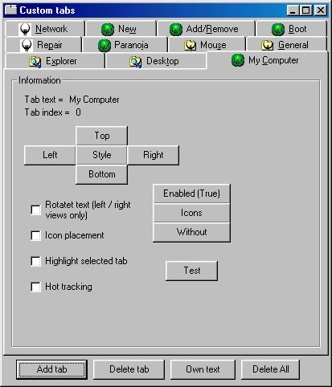



## Custom Tab

### Description

Have Tabs without Microsoft big OCX. I think this is nearly finished. Try right clicking on the frame control to bring up a popup menu.
 
### More Info
 

             |
---                |---
**Submitted On**   |2000-11-07 16:49:50
**By**             |[Gary Eyles](https://github.com/Planet-Source-Code/PSCIndex/blob/master/ByAuthor/gary-eyles.md)
**Level**          |Advanced
**User Rating**    |4.8 (24 globes from 5 users)
**Compatibility**  |VB 5\.0, VB 6\.0
**Category**       |[Custom Controls/ Forms/  Menus](https://github.com/Planet-Source-Code/PSCIndex/blob/master/ByCategory/custom-controls-forms-menus__1-4.md)
**World**          |[Visual Basic](https://github.com/Planet-Source-Code/PSCIndex/blob/master/ByWorld/visual-basic.md)
**Archive File**   |[CODE\_UPLOAD114251172000\.zip](https://github.com/Planet-Source-Code/gary-eyles-custom-tab__1-12602/archive/master.zip)

